# pipeliner

# Технологии
В основе лежит spring

Система сборки - maven

Контейнеризация - docker

Бд - postgresql

Тестирование - junit 5 + Mockito

# О приложении
Приложение основано на слоеной архитектуре, из-за чего при необходимости легко масштабируется

В Model описаны используемые сущности, они так же выступают основой для бд за счет @Entity

В отдельный слой вынесен валидатор, отвечающий за корректность графа (там проверяется, то граф не имеет циклов и проверяется, что мы не пытается сделать петлю (ребро из ноды в саму ноду)

В DAO описаны репозитории

В Service описаны основные транзакции (для безопасности данных) и описаны dto для совместимости с контроллером и передачи лишь нужных сущностей, а не полных entity из бд (особенно важно при расширении и потенциальном добавлении полей)

В Controller описаны энд-поинты, а так же написан кастомный обработчик ошибок, чтобы при неудачной операции не просто сбрасывать 500, а выдавать информативный json о том, что произошло

Так же в слоях описаны ошибки, характерные для этого слоя, обработка которых происходит централизованно в PipelineExceptionHandler

В App просто основной файл запуска, так же там есть application.yml с конфигурацией

Поднимать проект можно в докере, для этого написан docker-compose с двумя частями (postgre и само приложение), так же написан dockerfile для сборки и запуска проекта полностью в докере

# Запуск

Соответственно, запуск просто 
```
 docker compose up -d --build
```

Есть swagger для упрощенного взаимодействия с api

Так же я приложил .env.example, потому что написал параметризующиеся файлы инфраструктуры, соотвественно, для запуска необходимо создать и заполнить .env

# Тесты
В проекте написаны тесты:

Бизнес-логика сервиса (mock-тесты)

Логика графа (самоциклы, циклы и топологическая сортировка)

Энд-поинты

Тесты находятся в соотвествующих слоях (так же добавлен ci с тестами)

# Демонстрация
Несколько скринов из swagger с демонстрацией работы

### Создание графа
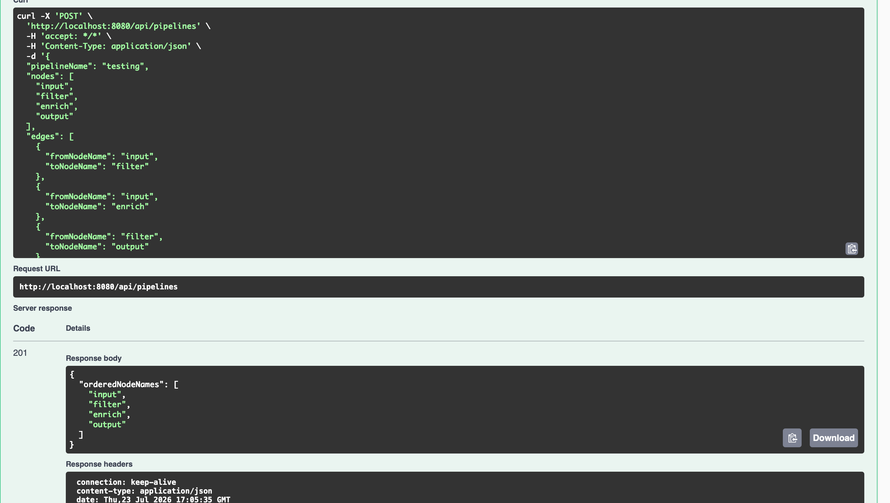
Создаем граф из задания - в респонс получаем вариант его обхода
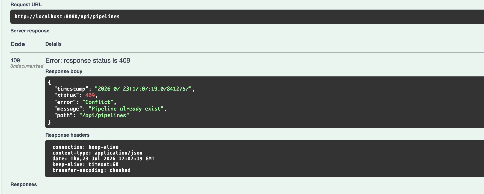
При повторной попытке - ошибка о том, что граф с таким названием уже существует

### Создание узла в графе
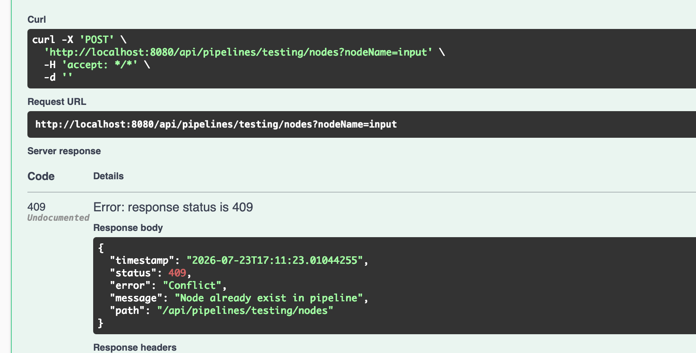
Попытка создать существующий узел в графе
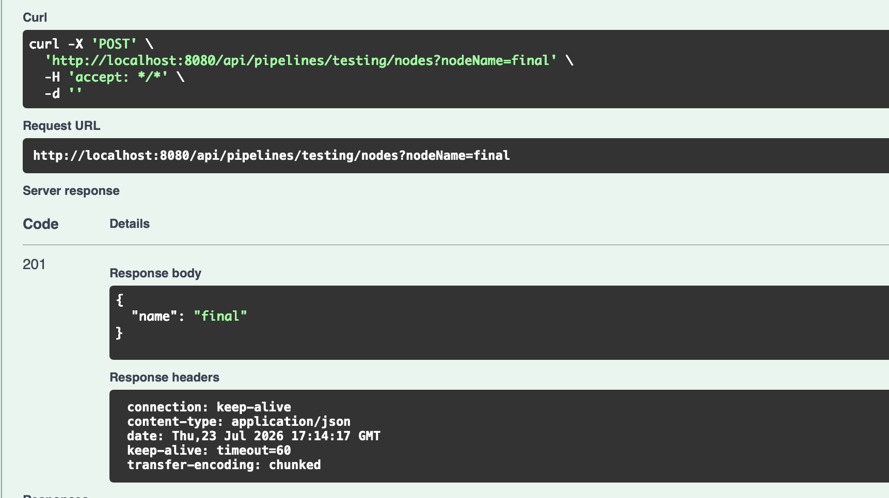
Создаем новый узел

### Создаем ребро
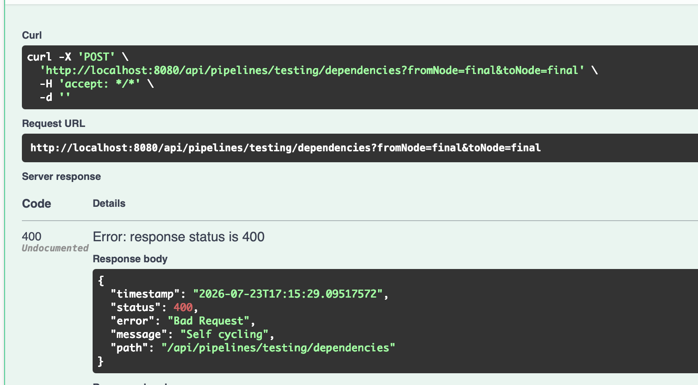
Самоцикл
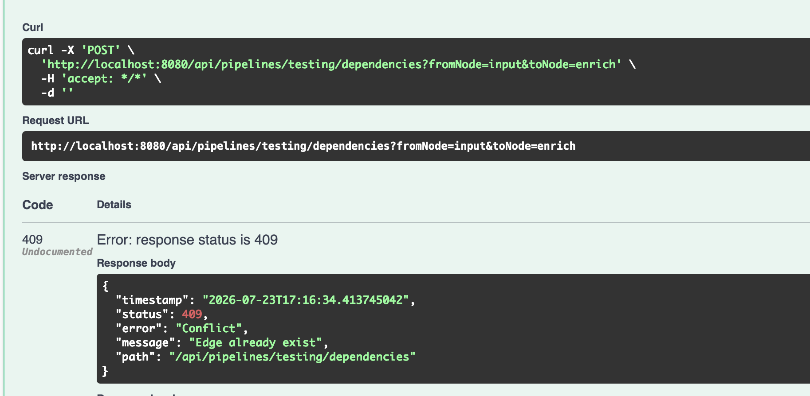
Создание существующего ребра
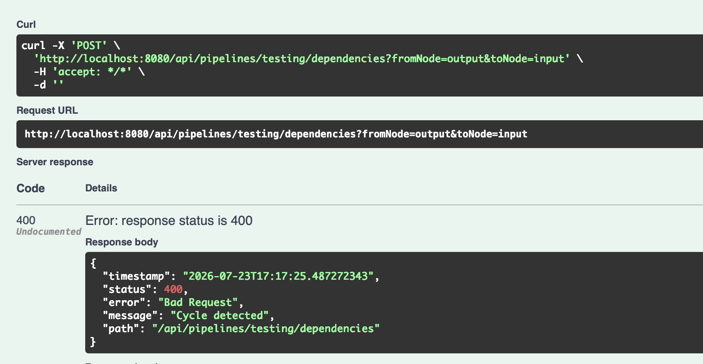
Попытка зациклиться
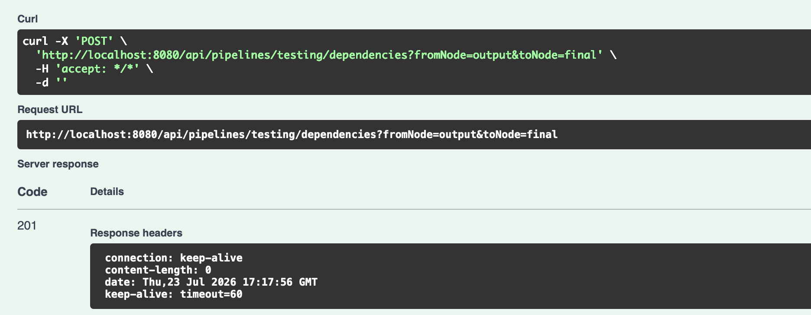
Рабочее создание

### Получение пайплайна
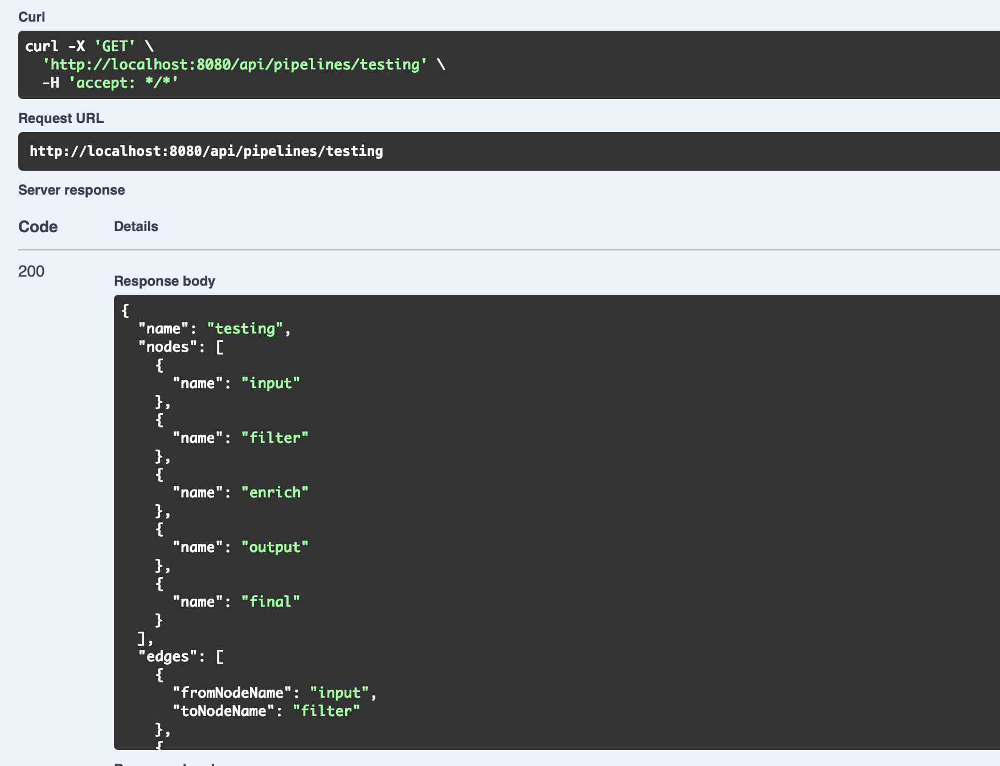
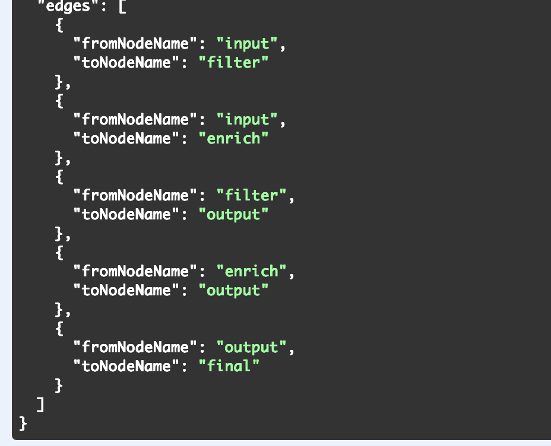
Получаем пайплайн

### Порядок выполнения узлов
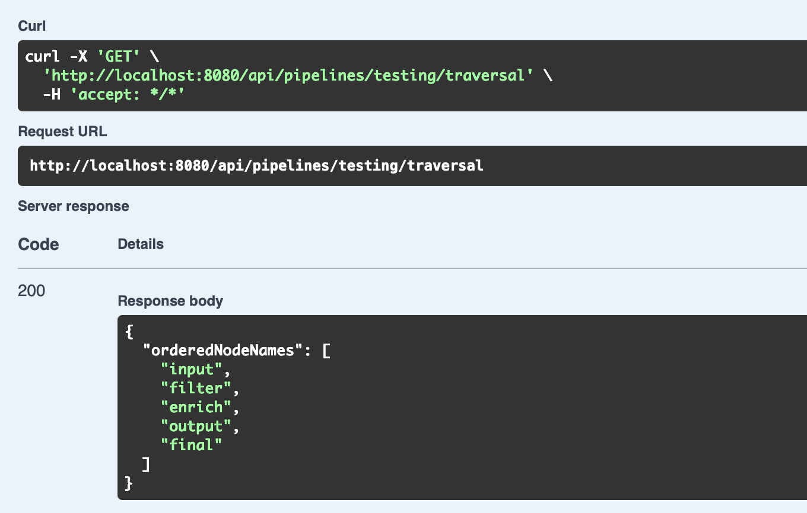
Получаем один из вариантов выполнения

### Обощение

Если где-то пытаться обратиться к несуществующемо пайплайну, или несуществующей ноде внутри пайплайна, то так же получаем соответствующую ошибку